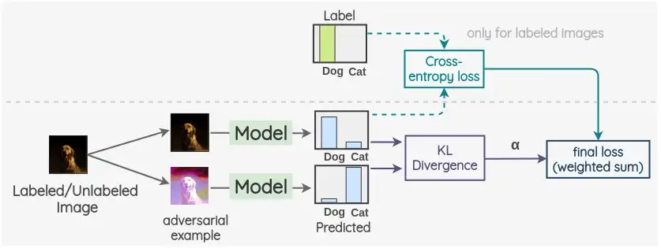
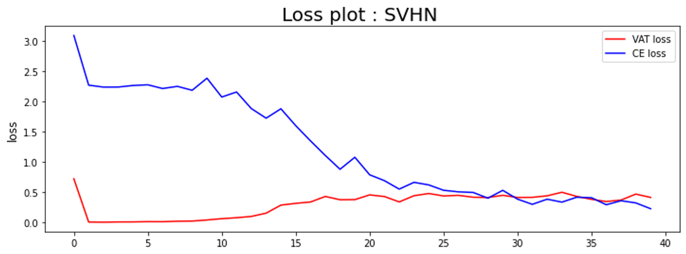
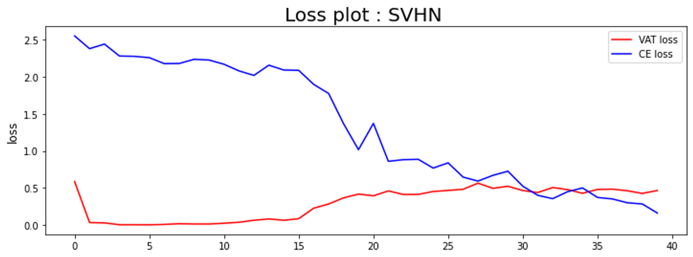
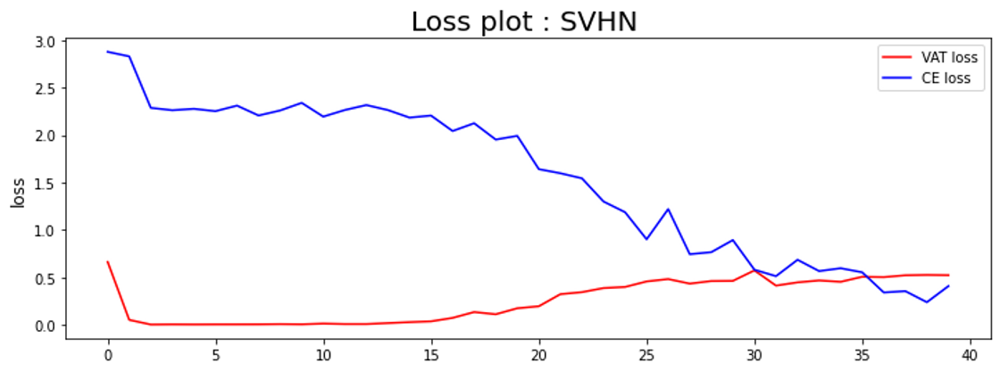
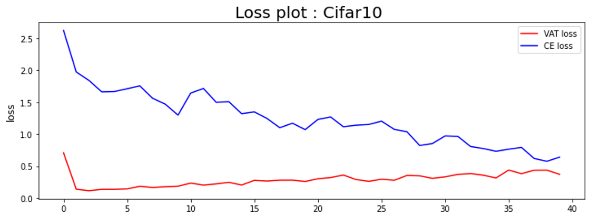
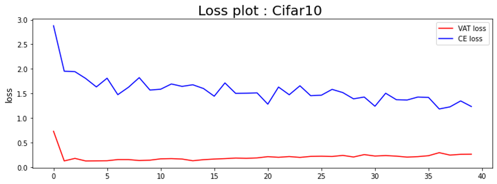

# Business_Analytics_ch5
# **[Ch.5] Semi-supervised Learning**
## VAT(Virtual Adversarial Training)

## 📂 Contents
-----------------------------
* Background
* Dataset
* Experiments
* Result
* Analysis

-----------------------------
### :pushpin: Background

## **Virtual Adversarial Training(VAT)**

- 논문 : Virtual Adversarial Training: A Regularization Method for Supervised and Semi-Supervised Learning [paper](https://arxiv.org/abs/1704.03976)

> 기존 adversarial training에서는 조금의 변화로 모델의 예측을 크게 바꿀 수 있는 방향을 적대적 방향으로 
이용해 그 방향으로 만든 샘플들을 학습시켜 모델의 결정 경계를 부드럽게 만들어줌

- 입력 데이터에 간단한 변형이 아닌 adversarial한 변형 채택
- virtual adversarial loss : 각 input 데이터의 conditional label distribution의 robustness 표현
- adversarial: loss의 값을 최대한 해치는 방향으로 변형 (KL divergence 이용)
- virtual adversarial training : label 정보를 사용하지 않아 semi-supervised learning에 적용이 가능함
- regularization technique 이용 : overfitting 방지, unseen example들에 대해 잘 generaliza할 수 있게 함
- adversarial training과의 차이점 : label을 이용하여 adversarial perturbation 생성
- 입력 데이터는 x, 정답 라벨은 y, x*의 경우 입력 데이터 전체 의미

- **절차**
1. input data point x에서 시작
2. 작은 perturbation r을 이용하여 x를 변형시킴 + transform된 데이터 포인트는 T(x) = x + r
3. perturbation r (adversarial 방향에 있어야) perturb된 input은 perturb되지않은 input의 output과 달라야함 (2개의 output distribution 사이의 KL divergence는 최대화 되어야함,  r의 l2 normd은 작아야 함)
4. adversarial perturbation과 transform된 input을 찾은 이후, kl divergence가 최소화되는 방향으로 모델의 weight을 update 시켜주고, 모델을 각기 다른 perturbation에 대해 강건하게 만들어줌

### 📂 Dataset
----------------------------
* Street
View House Numbers (SVHN) [download](http://ufldl.stanford.edu/housenumbers/)
    - 10개의 class로 구성 (1개의 digit을 1개의 class로 설정)

* Cifar10 [download](https://www.cs.toronto.edu/~kriz/cifar.html)
    - 10개의 class로 구성
    - 32 x 32 크기의 이미지 60000장으로 구성

### 🖍️ Experiments
----------------------------
- SVHN 데이터셋 : epsilon 값을 바꿔가며 실험 진행
    - epsilon = 2.0, 2.5, 3.0으로 설정

- Cifar10 데이터셋 : label 수를 바꿔가며 실험 진행
    - labels = 1000, 2000, 4000으로 설정

### 📊 Result & Analysis
------------------------------
### **SVHN 데이터셋**

|**epsilon**|2.0|2.5|3.0|
|:--:|:--:|:--:|:--:|
|**accuracy**|0.8770|0.8635|0.8883|

epsilon값의 변화에 따른 test accuracy는 다음과 같았습니다. epsilon값이 3.0으로 설정되었을 때, 가장 test accuracy가 높게 책정되었다는 결과를 확인할 수 있었습니다. 이는 epsilon값이 커지면 perturbation이 좀더 많이 적용된 예시들로 학습이 진행되면서 input에 perturbation이 추가되어도 model의 output에는 큰 변화가 생기지 않는, 즉, 강건한 model을 갖게 될 수 있다는 점을 의미합니다. 위의 경우, perturbation은 adversarial한 방향에 있게 된다는 점을 한번 더 짚고 넘어가면 좋을 것 같습니다.

#### **Loss plot** 

- epsilon = 2.0

- epsilon = 2.5

- epsilon = 3.0

### **Cifar10 데이터셋**

|**labels**|1000|2000|4000|
|:--:|:--:|:--:|:--:|
|**accuracy**|0.5148|0.5456|0.5745|

label 수를 각각 1000, 2000, 4000으로 설정하였을 떄, label 수가 증가할수록 성능이 점차 향상되는 모습을 확인할 수 있었습니다. 이는 학습에 있어 label 데이터의 확보가 중요하다는 점을 의미하며 특히 두가지 loss function 중 cross entropy loss와 연관이 되어 있어 결론적으로 전체 성능에 영향을 준다는 점을 확인할 수 있었습니다.

#### **Loss plot**

- labels = 1000

- labels = 2000

- labels = 4000

위의 결과에서 적은 label 데이터(1000개)를 사용하면 비교적 cross entropy loss가 빠르게 감소하는 부분을 발견할 수 있었습니다. 이를 해석해보자면 적은 수의 lebel 데이터를 이용할 경우, cross entropy loss에 이용되는 데이터의 수가 적기 때문에 이러한 결과가 나왔다고 해석할 수 있습니다.

### 🖍️ Conclusion
------------------------------
위의 실험에서는 SVHN 데이터셋과 Cifar10 데이터셋 2가지를 이용하였습니다. epsilon값을 조절해가며 실험을 진행한 결과 epsilon값이 증가함에 따라 perturbation이 많이 적용된 예시들이 학습에 사용되며 좀더 강건한 모델을 가질 수 있다는 결론을 얻을 수 있었습니다. 다음으로 label 데이터의 수가 증가함에 따라 성능에 향상이 있음을 확인할 수 있었습니다. 

### 📂 References
------------------------------
* https://github.com/pilsung-kang/Business-Analytics-IME654-

##### 용량으로 인하여 데이터셋과 결과(csv) 파일은 업로드하지 않았으나 파일 실행시 다운로드 및 저장이 가능합니다
